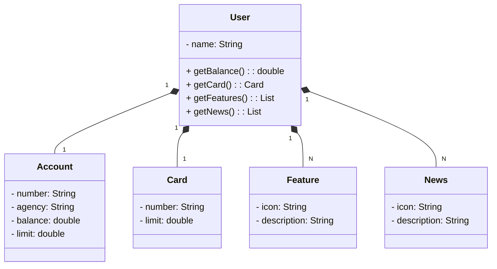

# Santander Dev Week 2023
Projeto Java RESTful API desenvolvido para Santander DEV Week.

## Diagrama de Classes

```mermaid
classDiagram
  class User {
    - name: String
    + getBalance(): double
    + getCard(): Card
    + getFeatures(): List<Feature>
    + getNews(): List<News>
  }

  class Account {
    - number: String
    - agency: String
    - balance: double
    - limit: double
  }

  class Card {
    - number: String
    - limit: double
  }

  class Feature {
    - icon: String
    - description: String
  }

  class News {
    - icon: String
    - description: String
  }

  User "1" *-- "1" Account
  User "1" *-- "1" Card
  User "1" *-- "N" Feature
  User "1" *-- "N" News
```
